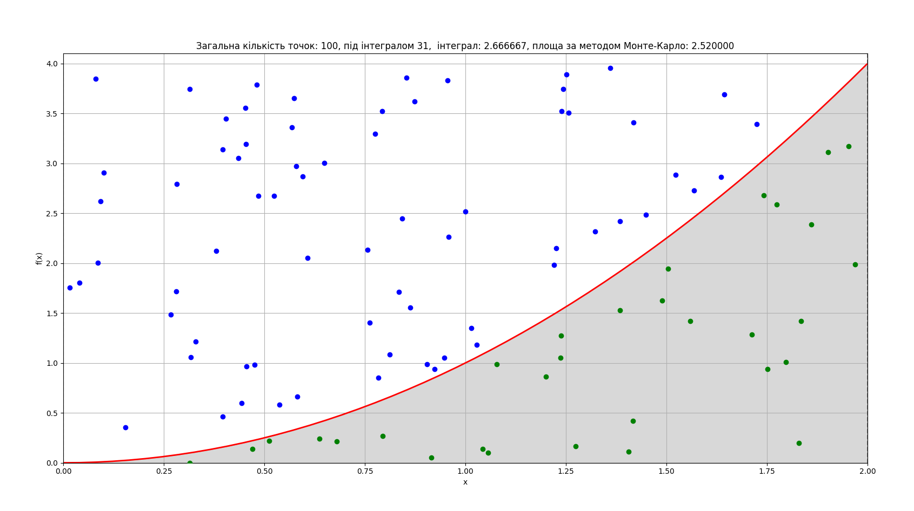
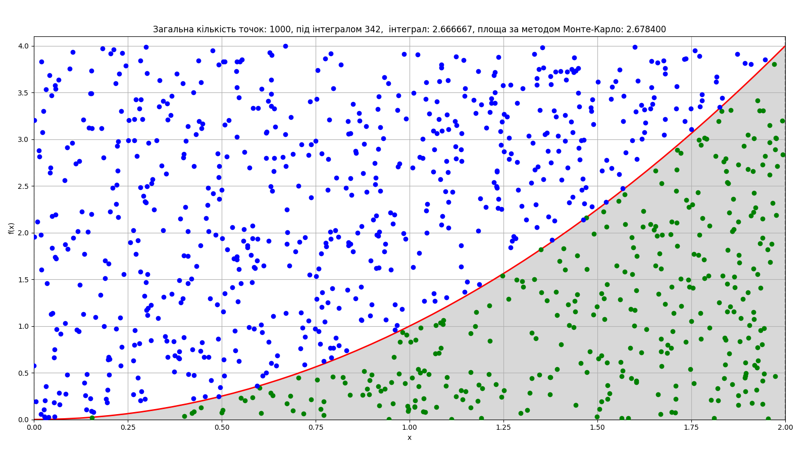
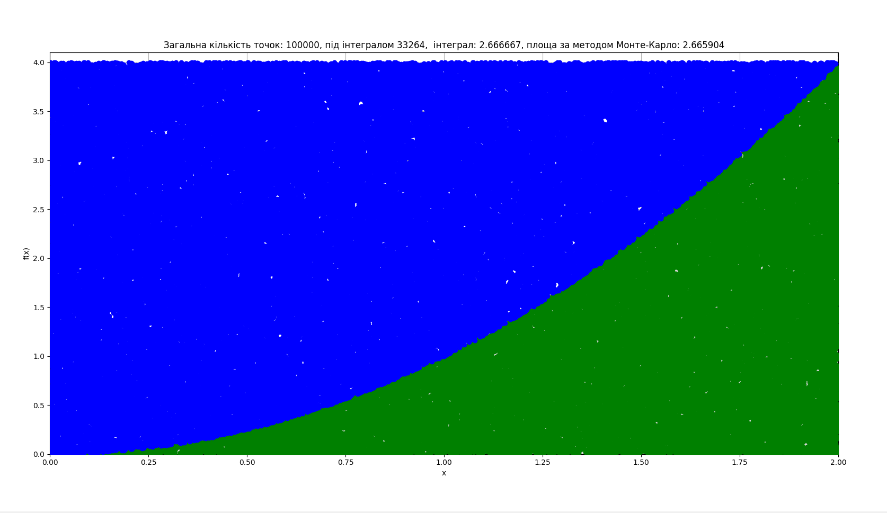

# goit-algo-hw-10

## Завдання 1

Реалізовано модель розрахунку, з відповідними обмеженнями яка дає наступний результат

```
Виробляти лимонад: 30.0
Виробляти фруктовий сік: 20.0
```

## Завдання 2

Реалізовано розрахунок площі за домогою методу Монте-Карло
Для цього:
- згенеровано рандомні значення координат точок на площині 2 x 4
- імплеметовано функцію яка вираховує положення точки (вище чи нижче нашої лінії)
- розрахунки проводились для різної  кількості точок та тестів, в результат виводимо середнє значення площі за n тестів


Результат експеремнту для  100 точок:



Результат експеремнту для 1000 точок:




Результат експеремнту для 100000 точок:



Вивід для  результатів тестів при кількості точок 100000
```
Загальна кількість точок під інтегралом 33601, площа за методом Монте-Карло: 2.688080
Загальна кількість точок під інтегралом 33515, площа за методом Монте-Карло: 2.681200
Загальна кількість точок під інтегралом 33408, площа за методом Монте-Карло: 2.672640
Загальна кількість точок під інтегралом 33155, площа за методом Монте-Карло: 2.652400
Загальна кількість точок під інтегралом 33662, площа за методом Монте-Карло: 2.692960
Загальна кількість точок під інтегралом 33094, площа за методом Монте-Карло: 2.647520
Загальна кількість точок під інтегралом 33011, площа за методом Монте-Карло: 2.640880
Загальна кількість точок під інтегралом 33391, площа за методом Монте-Карло: 2.671280
Загальна кількість точок під інтегралом 33397, площа за методом Монте-Карло: 2.671760
Загальна кількість точок під інтегралом 33393, площа за методом Монте-Карло: 2.671440
Середнє значення площі за методом Монте-Карло за 10 експеремнів: 2.669016
```
Як бачимо з графіків та значень, при збільшенні кількості точок площа інгегралу розрахована за допомогою методу Монте-Карло приближається до програмного розв'язку.

Можемо зробити висновок, що даний метод дає значення які наближені до реальних результатів, при збільшенні експеремнтів.